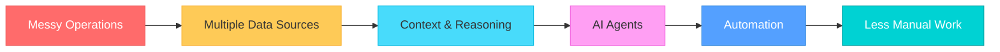

<!-- ===================================================== -->
<!--              GANESH CHANDAK — GitHub Profile            -->
<!-- ===================================================== -->

<div align="center">

<!-- Animated Header -->

<br/><br/>
<!-- Status Badges with Glow Effect -->


<br/><br/>

<!-- Animated Typing SVG -->

<br/><br/>
<!-- Animated Wave Divider -->

</div>

---

## 🎯 The Mission

<div align="center">

> **"Every repetitive business process eventually deserves to become software."**

</div>

I'm building **Kairo** — an Operational AI that investigates, reasons, and answers across your data, docs, and workflows. No more switching between SQL, Slack, dashboards, and documents.

**Previously:** Analytics Engineer at scale | **Now:** Building the future of operational intelligence

---

## 🚀 Products I've Built

<table>
<tr>
<td width="50%" valign="top">

### 🧠 [Kairo](https://github.com/ganesh-chandak) `IN PROGRESS`

**Operational AI for business teams.**

Instead of opening 5 tools to investigate a metric.

Kairo does it all in one conversation.

```
🤔 Your Question
      ↓
   AI Reasoning
      ↓
   Data + Docs + Context
      ↓
   Actionable Answer
```

**Stack:** Python • OpenAI • LangGraph • MCP • FastAPI

</td>
<td width="50%" valign="top">

### 📷 [Visuale](https://github.com/ganesh-chandak) `LAUNCHED`

**AI-powered visual notebook.**

Capture screenshots.
Search them forever.

No manual organization required.

```
📸 Capture
      ↓
   AI Indexing
      ↓
   Semantic Search
      ↓
   Find Anything
```

**Stack:** Flutter • Dart • AI Vision • Riverpod

</td>
</tr>
<tr>
<td valign="top">

### 👥 [Candidate Finder](https://github.com/ganesh-chandak) `COMPLETE`

**Autonomous recruiting workflow.**

Google Form → AI Search → Candidate Ranking → Excel Report

*Fully automated end-to-end pipeline.*

</td>
<td valign="top">

### 💳 [Card Analyzer](https://github.com/ganesh-chandak) `COMPLETE`

**Turns credit card statements into insights.**

• Spending Trends • Merchant Analysis<br>
• AI Summaries • Interactive Dashboard

*From raw data to actionable intelligence.*

</td>
</tr>
</table>

---

## ⚡ How I Think

<div align="center">



Most business problems aren't actually hard. They're just spread across too many tools. The real work is stitching context together and letting AI do the investigation.

</div>

---

## What I Work With

<div align="center">

### 🤖 AI & Intelligence
<p>


</p>

### 📊 Data & Analytics
<p>


</p>

### ⚙️ Backend & Infra
<p>


</p>

### 📱 Mobile
<p>


</p>

</div>

---
## 🔭 Currently Exploring

<div align="center">

| Area | Interest Level |
|------|----------------|
| 🤖 Multi-Agent Systems | ██████████░ 90% |
| 🧠 AI Memory & Context | ██████████░ 85% |
| 🔗 MCP Ecosystem | ████████░░ 80% |
| 🕸️ Knowledge Graphs | ███████░░░ 70% |
| 🔄 Autonomous Workflows | █████████░ 88% |

</div>

---

## 💡 Philosophy

<div align="center">

> **"Build software that removes work — not software that creates more dashboards."**

</div>

---

## 📫 Let's Connect

<div align="center">

<a href="https://linkedin.com/in/ganesh-chandak">
  
</a>
<a href="https://ganesh-chandak.lovable.app" target="_blank">
  
</a>
<a href="mailto:ganeshchandak7890@gmail.com">
  
</a>
<a href="https://github.com/ganesh-chandak">
  
</a>
<br/><br/>

<!--  -->

</div>

---

<div align="center">

### Thanks for stopping by!

**Building AI products • Learning continuously • Shipping relentlessly**


</div>
